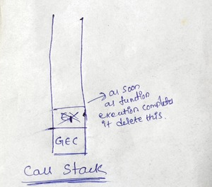

- 

- **its a stack and everytime in the bottom of the stack we have our global execution context**
- that means whenever any js program is run this call stack is populated with this global execution context
  whole execution context is pushed inside inside this stack
- rememeber whenever function is invoked a new execution context is created so this execution context put inside the call stack so **let me just denote it by E1** which is execution context 1
- once we are done with executing this function we return the **ans** so what happened now this **E1 is popped out of the stack** and control goes back to the global execution context where it left
- so control goes back to the line number 6 okay? got it?
- and then we move on to line number 7 where the new function was invoked and new **execution context** will be created similarly E2 will move up to the stack
- once whole function was executed then E2 will also move out of stack and control goes back to global execution context
- **so this call stack only for managing these execution contexts**
- after whole thing is executed the call stack gets empty the **GES** also gone from this call stack

- **call stack maintains the order of execution of execution contexts**
