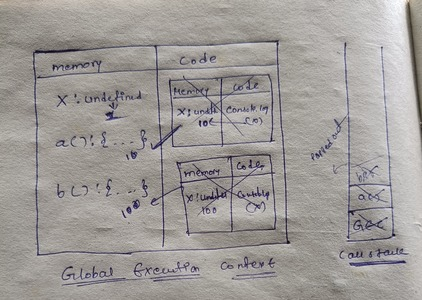
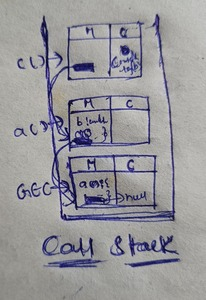
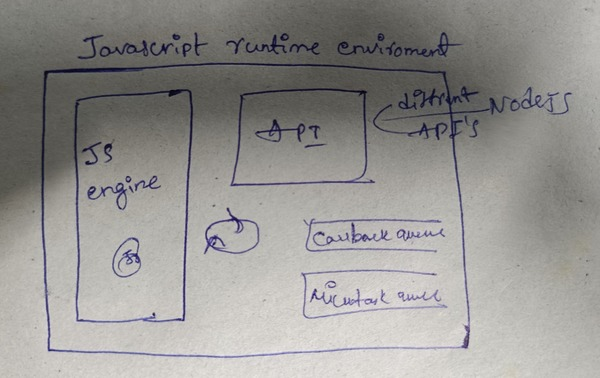
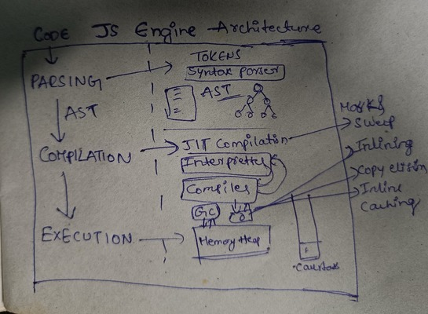

- do u know when u run javascript code alot of things happen behind the scene inside **javascript engine**
- Everything in javascript happens inside an **execution context**
- javascript isn't possible without this beautiful execution context
- javascript is loosely typed language so loosely typed means it does not attach any specific data type to its variables
- so suppose if i created a and assigned string value later on in the program i can assign number as well
- javascript also known as weekly typed language its not week at all infact i feel that language is more stronger because when u give string value it takes value handle behind the scene and if u give number it takes that value and puts number in it and manages all these things behind the scene so infact i feel that its more flexiable and beautiful

## what happens when u run Javascript Code?

- when we run javascript program **Global Execution Context** will be created
-         var n =2;
          function square(n) {
            var num = n * n;
            return num;
          }
          square2 = square(n);
          square4 = square(4);

**- execution context created in 2 phases**

1. **<a href="/Memory_Creation.Md">memory creation phase </a>**
2. **<a href="/Code_Excecution.md">code execution phase</a>**

## what is Hoisting and How Hoisting Works?

- **<a href="/Hoisting.md">Hoisting</a>**

## Function Invocation & Variable Environment

**- we can invoke the function even before initialization because of hoisting**

- **Example**
-     var x =1;
      a();
      b();
      console.log(x);
      function a() {
        var x =10;
        console.log(x);
      }
      function b() {
        var x = 100;
        console.log(x);
      }
- **output:**
  10
  100
  1
- 

### do u know What is Shortest Javascript Program?

- empty javascript file only Shortest Javascript Program
- eventhough file is empty Javascript doing lot things behind the scene
- when u run empty javascript file still javascript do its job it creates **GES(Global execution context)** also sets up memory space eventhough there is nothing to setup still it does it job
- javascript also creates something known as **window** here just go to developer console in browser write window & execute it willgive **window object**
- window object contains alot of funtions and variables and u can use these functions and variables anywhere in your javascript program
- this functionality given us by javascrpit engine
- just like **window** JS also creates **this** keyword

**what is window object**

- window is actually a global object which is created along with the Global Execution Context
- whenever any JS program is run global object is created
  and global execution context created along with that **this** variable is created
- this global object in case of browser **its window** and in case of node **its something else**
- eventhough file is empty javascript creates its global object
- at global level **this === window** is true
- whenever you create execution context **this** is created along with it even for the **functional execution context** as well
- at the global **this** point to **global object** that is **window** in the case of browser

### what is global space?

- any code you have written in javascript file not inside the function
- anything you see in the top level is global space
- in simple words anything which is not inside any function its global space
- anything you created at global space these functions and variables get attached to the global object that is **window**
- in below program a and b() are at the global space and x is in local space
- if u dont put window before a then it assumes you are referring to global object
- suppose you are executing x in that case it will refer to global object here x is not defined in global object so it gives x is not defined
- at global level **this** points to window object so **this.a or window.a or a** everything give same output all are referring to the same memory
-     var a =10;
      function b() {
        var x = 10;
      }
      console.log(window.a);
      console.log(a);
      console.log(this.a);
      console.log(x);

## undefined vs not defined

- **undefined is special keyword in javascript its not there in other languages**
- javascript allocate memory to functions and variables even before executing single line of the code
- undefined is like a placeholder which is placed in the memory that special keyword is undefined
- undefined is very diffrent then the not defined
- **not undefined** means javascript even not allocation memory for that
- **undefined !== not undefined** some people think undefined means its not taking any memory no its a special keyword it takes up its own memory u can assume it to like a placeholder which is kept for the timebeing until variable is assigned some other value
- dont put **a = undefined** its not a good practise to do that because javascipr its self provide that special keyword if u dont assign value
-     var a;
      if(a === undefined) {
        console.log("a is undefined");
      } else {
        console.log("a is not undefined");
      }

## Scope Chain & Scope & Lexical Environment

### Scope

- scope means where u can access a specific function or variable in our code
- there are 2 aspects to it
-     function a() {
          var b = 10;
          c();
          function c() {

          }
      }
      a();

- so first what is the scope of this variable b that means where i can access this variable b that is scope and other way is **is b inside the scope of the function c** that means can i access this b inside c
- scope is directly dependent on lexical environment

### Lexical Environment

- whenever execution context is created a lexical environment also created
- lexical environment is the local memory and reference to the lexical environment of it parent when i say parent its lexical parent where actually that function sits inside that code
- in below example you can see **c** is lexically inside **a** so **c** lexical parent is **a** and **a** lexical is parent is **global execution context**

-       function a() {
            var b =10;
            c();
            function c() {
                console.log(b);
            }
        }
        a();
        console.log(b);
- 

- lexical means **in order** or **in hierarchy**
- **c function** lexically sit inside the **a function** that means **in order** or **in hierarchy**
- **c function** physcially present inside **a function** that means **c function** lexically present inside **a function** and **a function** lexically inside **global scope** so this is known as **lexical**
- when i say lexical environment means its **local memory along with lexical environment of its parent**

### Scope Chain

- Javascript engine first looks for its variable or function inside the local memory of that function if not found it keeps on searching the lexical environment of its parent until it finds the variable or function being accessed this mechanism is called **Scope Chain**
- if the variable accessed is not found in **Scope Chain** then you will get variable is not defind error in the browser consoel
- The whole chain of lexical environment is known as **Scope Chain**

## what is Temporal Dead Zone? && Are let & const declaration are hoisted && Syntax Error vs Reference Error vs Type Error

-      console.log(a);
       let a = 10;
       var b = 1;

### are let & const declarations are hoisted?

- yes **let & const declarations are hoisted** but they are hoisted very diffrently then **var hoisted**
- when u are trying to access **let & const declarations** it gives error in browser console **u can not access before initializtion** so here only its saying this value (a value) in temporal dead zone for time being
- u can say these are in temporal Dead Zone for time being
  -suppose memory was assigned to **b** to the var declaration and this variable **b** attached to the global object incase of **let & const** for them also allocated memory that is only called hoisted but they are stored in separate memory space then global object
- and you can not access this memory space this **let & const values** before you put some value in them that is what hoisting in let & const
- suppose for **b** you can access **window.b** but for **a** you can not access using **this or window** because **a** not attached to the **global object**
- here u can say **let** little more strict then **var**

- **what is best way to avoid temporal dead zone issues?**

- **always try to put declaration & initialization on the top to avoid temporal dead zone so that as soon as code starts it hits the initialization part first so you wont get alot of unexpected error**
- **you can say we are shrinking temporal dead zone to zero while moving initialization to the top**

### what is the Temporal Dead Zone?

- Temporal Dead Zone is the time since when this let variable was hoisted and till it is initialized some value **that time between that is known as temporal Dead zone**
- in simple words we can say from hoisting till it is initialized with some value that phase is known as **Temporal Dead zone**

### what is the Reference Error?

- whenever you are trying access variable which is in Temporal Dead Zone it gives You **Reference Error** so u can not access it until its assigned with some value
- if suppose you are trying to access any value(ex: x) which is not initialized in the code then also you will get **Reference error** says x is not defined
- when javascript trying to findout specific variable inside memory space and you can not access it then it gives us **Reference error**

- **Reference Error example1**
-          console.log(a);
           let a = 10;

- another reference error is you are trying access x value which is not even there stored in memory space then you will get Reference Error

- **Reference Error example2**
-          console.log(x);
           let a = 10;

### what is the Syntax Error?

- **Syntax Error example1**
-        let a = 10;
         let a = 5;
         var a = 4;
- using let keyword redeclaration not possiable with same name here **ex :** if u redeclare with same **let a** again in the same scope it will give **Syntax Error** like **identifier a has been declared already** even if you use **var a** also its same but **you can declare var b =1; and var b =2 twice**

-        console.log("hello javascript");
         let a = 10;
         let a = 5;

- **no code will be run** example: in above program even if u write on the top also it does not even reach single line of code it just affront says its not possible

### diffrence between let & const

- **const** is more strict then **let**

**Syntax Error example2**

-       let a;
        a = 10;
        const a;

- incase of let you can declare value first and intialize value later on but if you use const you have to initialize value at the time of declaration only otherwise browser will throw error like **SyntaxError:Missing initializer in const declaration**

**TypeError example**

-       const a =1000;
              a =2000;
- here for const a if u are trying assigne some other value later on you will get an error like **TypeError: Assignment to constant variable**
- **what is TypeError?**
- you are trying to initialize other value for the constant type here you can assume it to be **a** is type const it should be declared and initialized at the same time here its **TypeError**
- if u want more deep information with alot of example refer below link
- https://developer.mozilla.org/en-US/docs/Web/JavaScript/Reference/Statements/let

### what is Block?

- Block is defined by curly braces **{}** this is perfectly valid javascript code
-      {
         // this block also known as compound statement**
       }
- Block is Combining multiple line of javascript code into group
-      {
          var a=10;
          console.log(a);
       }

- **why do we need to group all these statements together?**

- we need to group all these statements together so that we can use multiple statements in the place where javascript expects the single statement
- suppose if we write simply **if(true)** then you will get **SyntaxError:Unexpected end of input** that means its expecting one statement so even if u write **if(true) true** it is correct but if u want to write multiline code as a single statement in the place where javascript expects the single statement then we use **block**
- **example**
-      if(true) {
           var a = 10;
           console.log(a);
       }

### What is Block Scope?

- what are all variables and functions we can access inside that block is known as **Block Scope**

-     {
         var a=10;
         let b=4;
         const c =4;
         console.log(a); //10
         console.log(b); //4
         console.log(c); //4
      }
        console.log(a); //110
        console.log(b); // reference error b is not defined because b is accessiable within that block
        console.log(c); // reference error b is not defined because c is accessiable within that block

- these variables **a & b** are hoisted and allocated memory in separate memory space that is **Block** but here for variable **c** memory is allocated in **Global object** that is why let & const are block scoped you can not access these values **outside the block** but here **c** value you can access outside the block because **c** value stored in global object

### what is shadowing in JS?

- suppose if u have same named variable outside the block so inside the block variable shadows the outside block variable
- **example 1**
-          var a = 100
           {
             var a = 10;
             console.log(a); //10 here its shadows outside block variable a
           }
           console.log(a)//10 here it shadows and replace 100 with 10 because both are pointing to same memory space that is global object

- **example 2**
- even for **const** also same example you can replace **let** with **const** and check the below example
-          let b = 10; //this b value stored in separate memory space which is in Script

           {
            let b = 5;//this b value stored in same memory space that is Block Scope
            console.log(b); // 5 because this b value over here shadowing b value of 10 that is only called shadowing
           }
            console.log(b); // 10 because here it refers value from diffrent memory space and give the value

- **example 3**
- **even for function scope shadowing behaves in same way**
-     const a =10;
      function x() {
         const a =100;
         console.log(a);//100
      }
      console.log(a);//10

### what is Illegal Shadowing in Js?

**example 1**

-      let a=10;
       {
        var a=100;// this is Illegal Shadowing you can not access let using var it will an error a already declared
       }

- why you will face this error because **a** value should not cross that block scope area but if you use **var** it will cross that border because **var** is **function scoped** see below example **this is perfectly valid** because now **a** is inside that boundary its not interfering with outside **a** value

-      let a=10;
       function x() {
        var a=100;// this is Illegal Shadowing you can not access let using var it will an error a already declared
       }
- **block scope also follows lexicals scope and it follows that lexical scope chain pattern only**
- **example**
-              let a = 10;
               {
                 let a =100;
                {
                  let a = 1000;
                  console.log(a);//1000
                }
                console.log(a);//100
               }
               console.log(a);//10
- **whether you use function keyword or arrow function both are same whatever rules applied with function keyword same rules will be applied to arrow function**

## Closure

- closure basically a function bind together with its lexical environment
- function along with its lexical scope forms a closure
- **functions you can assign to variable and you can function as paramenter and even you can return the function also**
- in below example you can see you are invoking the **x()** and when u invoke that function global execution context created and for **y()** also at code execution phase Execution context created and it return **y** value and vanishes once that exectuion finishes
- now **z** contain this **y()** here we return **y()** outside the **x()** so no longer its inside the **x()** so now we can use **y()** outside the **x()**
- suppose there are 1000 lines of code at some time we want to invoke **z()** it will try to findout **a** value here **a** is not there in global scope and **x** also not there its gone right
- but here you will get output as **7** here **closure come into the picture** functions are so beautiful that when they are returned from another function still that function remember its lexical scope they remember where they were actually present though x function not present still y function remembers its lexical scope where it came from
- when u return y not just that y function returned that closure was returned That's why when you execute the z function somewhere else it still remember **reference to **a** memory location(the label a or the identifier a)** not just a value and it tries to find out a which is 7 it print that 7 that's what closure is
- that closure enclosed with function along with its lexical scope
- **Example 1**
-     function x() {
           var a =10;
          function y() {
             console.log(a)
          }
          return y;
        }
        var z = x();
        console.log(z) // it returns the function
        z() // 10

- in Example 2 it froms a closure along with **b** which was its parent parent and along with **a** which was its parent that is known as closure
- **Example 2**
-        function z() {
             var b=100;
             function x() {
                var a =10
                 function y() {
                    console.log(a, b);
                 }
                 y();
             }
             x();
         }
         z();

- Uses of Closures
  - Module Design Pattern
  - Currying
  - Functions like once
  - memoize
  - maintaining state in async world
  - setTimeouts
  - Iterators
  - and many more...

### Settimeout And Closure Interview Questions

- this function forms the closure. this function remember reference to i it forms a closure wherever it go it takes the reference of i along with it
- **setTimeOut** takes this callback function and stores into someplace and it attaches the timer 3000 millisceconds to it and javascript proceeds **it doesn't wait for anything.** it just go the nextline and print namasthe javascript and when the timer expires it takes that function puts it again into callstack and runs it that's how **setTimeout** works

-     function x() {
          var i =1;
          setTimeOut(function() {
             console.log(i);
          },3000);
          console.log("Namasthe Javascript")
      }
      x();

- **interviewer ask you to print 1 2 3 4 5 using this setTimeout?**
- suppose here if you use **var i =1;** in for loop instead of **let i=1** then it print the **6 6 6 6 6** 5times because each time it takes this callback function and stores into someplace and attach timer and it remember reference to i not just i value.
- so when loop run 1st time it takes callback function and attach timer similarly this 5 copies of function all of them refering to same memory location that is reference of i.
- because environment of all of this functions are same
- 2nd thing javascript does not wait for anything it stores all these 5 functions and move on so it will print namasthe javascript.and when the timer expires its too late and value of i becomes loop was constantly running right it is 6. and when the callback function runs on that time the value of will be 6

-     function x() {
          var i =1;
          for(let i=1; i<=5; i++>){
            setTimeOut(function() {
             console.log(i);
            }, i*1000);
          }
          console.log("Namasthe Javascript")
      }
      x();

- easy way to fix this is use **let in for loop** because **let has block scope** that means whenever each time loop runs this **i** is a new copy of all together
- and eachtime setTimeout runs this callback function has new copy of **i** with it
- here it makes 5 copies of **i** variable with it and they form closure with each and every function
- in simple words each time this function calls this **i** refers to diffrent memory location each time

- **suppose if interviewer ask u to resolve problem using var keyword only?**
- yes we can this using closure. here every time you call this close function with **i** it creates the new copy of **i** with it

-     function x() {
          var i =1;
          for(let i=1; i<=5; i++>){
            function close(x) {
              setTimeOut(function() {
              console.log(x);
              }, x*1000);
            }
             close(i);
          }
          console.log("Namasthe Javascript")
      }
      x();

### Closure Interview Questions

- **what is closure?**
- a function along with reference to its outer environment together from a closure so in otherwords we can say a closure is combination of its function and its lexical scope bundle together forms a closure

for more questions go through this **<a href="/closure_interview.md">Closure Interview Questions</a>**

### First Class Functions

- Functions are very beautiful in javascript and functions are heart of javascript

- **Function Statement also Known as Function Declaration**
- if you give function keyword and function name this is known as function statement. This way of creating known as **function statement**
- **Example**
-      function a() {
          console.log("a called");
       }
       a();

- **Function Expression**
- A beautiful feature of function is you can assign it to the variable also. function acts like a value.this is known also **function expression**
- **Example**
-      var b = function () {
            console.log("b called");
       }
       b();

- **Diffrence between Function Statment and Function Expression is Hoisting** because see above 2 programs when u try to invoke first one before its initialized **a()** then u will get output because at memory creation phase for a that complete function copied and pasted over there
- but in the second program its diffrennt here if u try to invoke **b()** before its initialized then it gives **b is not a function** because at memory creation **b** treated as variable stored as **undefined** in memory creation phase not function so until that line will be executed you can't invoke that function

- **Anonymous Function**
- function without name is known as Anonymous Function. Anonymous Function Does not have their own identity. these means if u create Anonymous function like below program it gives the syntax error.
- **Example**
-       function() {

        }

- why Syntax Error Anonymous Function looks like Function Statement only but it has no name according to **EcmaScript specification** function statement always should have name so that example program is invali syntax you can run and check
- it clearly gives **SyntaxError: Function statements require a function name**
- Anonymous Function are used when the Anonymous Functions are used as the values. that means just like you assign values to variable. you can assign this anonymous function to some variable. so it acts like a variable.
- but in Function Statement you can not use Anonymous Functions that is why Syantax Error

- **Named Function Expression**
- Named Function Expression Exactly Same as Function Expression only but instead of Assigning Anonymous Function we Assign Named Function to the Variable
- giving name for variable and for function also but this is possible in javascript
- you can have the name of the function itself and put it into the expression so this is known as **Named Function Expression**
- **Example**
-      var b = function xyz() {
             console.log(xyz)//u can access over here
             console.log("xyz called")
       }
       b();
       xyz(); //you can not call like this you will get error Refrence Error xyz is not defined
- why xyz is error because here you assigned function to the var b it won't create memory in outer scope but it created as local variable means you can access xyz() function inside that function. this is what called named function expression

- **Diffrence Between Parameters an Arguments?**
- the values which you pass inside th function known as Arguments
- these identifiers here param1 & param2 which gets those values are known as Parameters
- **Example**
-        var b = function(param1, param2) {
           // here param1 & param2 are called parameters you can access these within that function only
         }
         b(1,2)// this 1,2 are arguments.

- **First Class Functions**
- The ability of functions to be used as the values and assgined to the variable and can be passed as argument into another function and can be returned from another functions this ability all together known as First Class Functions

- insted of passing arguments we can pass functions inside the another function as an argument
- **Example 1**
-       var b = function(param1) {
             console.log(param1);
         }
         b(function () {

         }); // here Anonymous function to be passed as an value also

- **Example 2**
-       var b = function(param1) {
             console.log(param1);
         }

         function xyz() {

         }

         b(xyz);

- **Example 3**
-       var b = function(param1) {
             return function () {

             }
         }
         console.log(b());

- Function are First Class Citizens means as same as First Class Functions both meaning is same
- even if you use **let & const** also it behaves in same way

- **Arrow Functions**
- These Funtion Expresesion, Function Declaration, Function statment these all things can be returned from Arrow Functions Also
- Arrow Functions Are Introduced in Es6

### Callback Functions In Js

**what is callback functions in JS**

- functions are first class citizens in javascript that means you can take the function and pass it into another function and when u do so this function which you pass into another function is known as
  **<a href="/call_back_functions.md">callback funtions</a>**

### Event Loop

- as you know javascript synchronous single threaded language only one thing execute at one time in call stack and this call stack present in javascript engine and all code in the javascript execute inside the callstack
- and anything comes inside callstack executly quickly it doesnot wait for anything
- **what if we need to run any script after 5 seconds?**
- no we cannot do that.because whatever comes inside callstack it execute immediatly.it you give it script execute it after 5 seconds it cannot because callstack doesnot have timer
- suppose if we have to keep track of the time and we have to execute code after some delay we will need some extra super powers of timer.
- let us see we will get that super power

- if u see diagram call stack is inside javascript engine and javascript engine is inside the browser
- so this browser overall this JS engine in it and Js engine has call stack and inside that program runs
- it also has something known as local storage in it.it can store some data inside it r8?
- you can have timer inside the browser and you also have URL where you write netflix or anything watch your own thing
- this browser has super power of communicating to the external world like netflix server.
- suppose if we have netflix servers if you want to fetch good tv series so this browser can make connection with the server and get the data over there
- even after getting data it displayed in the UI and it also has super of power access ex:bluetooth,geolocation.. etc..
  -if we need access to these super powers.suppose we need to access **timer** or **local storage** or **bluetooth** etc..whatever we need to have that kind of connection
- this js engine need some way to access these super power right.let us see how we can do it

### Web Apis

- to access all these super powers we need **web apis**
- setTimeOut() is not part of javascript and even dom apis document.elementByid whatever you do with document is not part of javascript and locastorage and fetch also
- even console.log() also not part of javascript
- these are the kind of super powers which browser have it. these are the part of the browser.
- and browser give us access to super powser inside JS engine.
- suppose if we have to use timer super power.browser gives access to setTimeOut and if we have to use DOM tree browser gives access to DOM Apis
- fetch gives access to make connection with other servers like external server.
- **we get it all inside the callstack using global object that is window**
- browser gives super power to javascript engine through the keyword called window
- suppose we if want super power of timer inside javascript engine then you have to do something like window.setTimeOut, for localstorage something known window.setTimeout that is how you get access to all these super powers.
- but when we write code we wont write window.setTimeOut(). because window is the global object and setTimeout present in this global scope so you can access setTimeOut without window keyword.
- so if you do window.setTimeOut() or only setTimeOut() its one in the same thing.
- so this browser wraps of all super powers into global object.and gives access of window to this callstack and now you can acces super powers

- **let us move on to examples**
- **Example 1 And Diagram 1**
-          console.log("start");
           setTimeOut(function cb() {
           console.log("callback")
           }, 5000);
           console.log("end");

- here basically console.log is the web api and logs something inside the browser console.and this console web api pluged through window to the javascript code
- and in the next line setTimeOut basically go and call setTimeOut web api this gives access to the time feature and it takes callback function and some delay
- so when u pass callback function to setTimeOut it basically register callback because we pass time it starts counting time inside the timer and move to next line and print **end**
- after completing execution **GEC** pops out of the callstack.and as soon as timer expires this call back needs to executed.
- because we know all this javascript code executed inside the callstack. we somehow need this callback function inside the callstack
- **now eventloop and callback Queue comes into picture**
- as soon as the timer expires this callback function needs to executed in callstack but it wont be execute directly. it will be executed through callback Queue
- so as soon as the timer expires this callback function pushed into the callback Queue and Event loop checks is something is there in callback Queue and its find that callback function and puts inside the callstack and this callstack quickly execute the callback function.
- how its executed is same like it create memory first and code execution same as previous executions
- event loop works like gate keeper it always verfies callback quere if something is present it puts inside the callstack

- **Example 2 And Diagram 2**

-      console.log("start");
       document.getElementById("btn").addEventListner("click", funcion cb(){
        console.log("clicked")
      })
      console.log("end");

- everything here is same as above example only writing setps which are diffrent than example 1
- addEventListner its a super power given by the browser to the javascript engine through window object in the form of web apis which DOM apis
- so whenever you do document.something it basically call DOM apis.so it basically fetches something from the DOM.DOM is document object model its like html source code
- whenever you access DOM apis it gives something from html source code based on id or something like that
- here **addEventListner** register callback on an event click.inside webapis environment this callback registered and event attached to it its click event
- this event will be there until and unless we close the browser or remove the eventlistner
- so once user click on the button this callback function pushed inside the callback queue and wait for execution here **Event loop is super hero** Event Loop keeps on monitoring this call stack and callback queue. suppose if callstack is empty and Event loop check whether anything pending to execute in callback queue if anything is there then it push that into callstack and executing call stack and callback queue will become empty

- **why do we need callback queue?**
- suppose user clicks on the button 7 times.in that case callback function pushed into the callback queue 7 times waiting to be executed inside the callback queue.

- here event loop continously checks whether call stack is empty or not. if its is empty there are some functiones lined up in callback queue so it takes that callback function and pushed inside the callstack and it executes and slowly slowly its pops off from callback queue and slowly slowly it executes all callback functions one by one
- so generally in real life applications we often see that lot of eventlisteners and lot of timer and other things happens inside browser right that is why we need to queue all of this callback functions together so that they get chance one after other because javascript just has this one callstack and everything execute here only. thats how whole thing works

**fetch example**

-      console.log("start");
       setTimeout(function cbT(){
          console.log("call back");
       },5000);
       fetch("https://api.netflix.com").then(
        function cbF() {
          console.log("cb netflix");
        });
        console.log("end");

- fetch basically goes and request api call this fetch returns the promise.and we have to pass the callback function which will be executed once promise is resolved.
- when we get data from server basically this callback function executed.
- **everything same as above example only few things are diffrent**
- here **cbt** and **cbf** are registered inside the web api cbt waiting for time to expire and cbf waiting for data to return from the server
- this fetch() will basically makes call to the netflix server and this server return data back to fetch.so once receive data from server this **cbf** ready to be executed.
- suppose if netflix servers are too fast and we receive data withing 50ms then cbf will be ready to executed once receive the data.
- just like this **callback queue** we also have something known as **microtask queue** its same callback queue but this is having higher priority.whatever function comes in this microtask queue executes first.and in callback queue executed second
- **what comes inside microtask queue?**
- all callback functions which comes through **promises** will go inside the microtask quere.there is alos something known as **mututation observer**(it will check basically keeps on checking whether there is any mutuatation in DOM tree or not if its there it executes)
- here cbf will go to microtask queue. incase of network calls will go to microtask queue.here job of event loop is keeps on checking callstack once call stack is empty it gives chance to these queues to execute
- suppose there 1000 million lines code in program so it takes some time to execute right but here already CBF waiting in microtask queue for executing but we are running million lines of code in our main thread.meanwhile we are running these million lines of code that timer also expired.so here browser is not doing one thing at a time its doing all of things behind the scenes. here javascript engine which is doing one thing at a time.
- so once 5000ms expires this is ready to be executed. CBT will go into callback queue now both CBF and CBT are waiting for executing but still million lines of code executed.
- here event loop continously check whether call stack is empty or not. if it is empty schedule this task. suppose million lines of code completed executing. and there is nothing to be executed. GEC will be deleted from call stack.
- here eventloop continously verify the callstack once call stack is empty.it will see there are some tasks pending in callstack queue and microtask queue. since microtask queue has higher priority first it will execute those tasks there it will pops off from microtask queue and call stack then it will execute callback queue task once its also done removed fromm callback queue and call stack

- **callback queue also known as Task queue**

- **what is Starvation in Js**
- suppose there is a task in microtask queue while executing this task its creating one more microtask like its creating so here the task which is present in callback queue will never get chance to execute.
- there are chances like task which is in callback queue does not get chance to execute for long time this is known starvation

### Js Engine Exposed

- javascript can run in browser & it can run inside server & inside watch & inside robot all these possible because of javascript runtime environment

**javascript runtime environment?**

- its like big container which has all things required to run the javascript code
- to run anypiece of javascript code you definetly need JS engine and it also have set of apis to connect to outer environment & we have event loop & callback queue & microtask queue and we can have lot of things inside javascript runtime environment
- javascript runtime environment is not possible without javascript engine so basically JS engine is heart of javascript runtime environment
- Browser can execute your javascript code because browser has javascript runtime environment
- if you nodejs also has javascript runtime environment and nodejs can run code outside the browser.suppose if you need to run JS code in cooler you need JS runtime environment
- JS can run in lot of devices because of this javascript enviroment
- and these API's diffrent in browser environment maybe diffrent in nodejs environment
- example: suppose in Browser we have local storage api which we use for accessing browser storage and in case of nodejs javascript runtime environment maybe diffrent. here there are common webapis names also for node and browser environment which is console.log() and setTimeout(). but maybe internally implemented diffrently.
- there are lot of javascript engines available each browser has diffrent javascript engine
- example: Microsoftedge has diffrent Jsengine that is **chakra** and mozilla has **SpiderMonkey** and similarly chrome has JSenigne which is **v8engine**
- these engines should follow ECMASCRIPT Standards
- **google about ecamscript and read about it**
- **what was the first javascript engine developed?**
- first javascript engine created by javascript creator himself. his name is Brendan Eich.he developed when he was working in netscape.that engine evolved alot and now it is **spidermonkey** which is using in MozillaFirefox

### Javascript Engine Architecture

- JS engine is not a machine.its just like normal code which is written in low level langugage.suppose v8 engine which is written in c++.its is like piece of code which is written by engineer like you and me.
- that piece of code which is JS engine takes the code which is high level code what we write inside javascript and kind of splits out machine level code which can be executed by machine
- JS engine takes Human Readable code as input. now this code now goes to 3 major steps

1. parsing
2. compilation
3. execution

- **parsing**
- during **parsing phase** code broken down into tokens.suppose you have written let a =7; then let divied like one token & a one token like that
- there is also something known as Syntax Parser.basically it takes code and convert into AST(Abstract Syntax Tree). so just type **const bestCourse = "javascript course"** in the link https://astexplorer.net/
  and see. it kind of genearate tree kind of structure.
- this is AST generated after the parsing level then passed into the **compilation stage**

- **compilation**
- Javascript has something known as JIT(just in time) compilation.
- **is Javascript interpreted language or compiler language?**
- many programming languages used interpretter for executing the code.so it takes code and execute line by line it doesnot know what will happen in nextline.that's how it will be executed.here code executed very fast
- other hand many language uses compiler to compiling the code.here first code will be compilied and code is compiled and new code is formed which optimized version of this code.then it executed.here code has more efficiency
- JS can behave like compiled language as well as interpreted language. everything is depended on JS engine
- when Brendan Eich created JS it used to interpreted language.it used to be run in browser. so browser can't wait for compilation before running or executing the code.
- but in todays world most of the moderen browsers uses an interpreter and compiler both together.so now its is purely depended on JS engine. whether its is purely interpreted or JIT compiler
- JS engine uses interpretter along with the compiler and that makes it JIT compilation.it used interpretter and compiler both for executing the code
- so now AST will go to the interpretter and it will convert high level code into byte code and that code moves to the execution code.while its doing so it takes the help of compiler to optimize the code.
- compiler bascially talks to the interpretter while code being interpretted line by line.here compiler also tries to optimize code as much as it can on the runtime that is why its known JIT compilation.it can happen in multiple phases
- there is something known as AOT(AHead of Time) compilation.in that case compiler takes the piece of code
  which is going to be executed later and try to optimize the code as much as it can.and it also produces byte code which is then goes to execution phase
- execution phase not possible without these 2 components which are Memory Heap and callstack
- Memory Heap this is place where all memory stored.its constantly sink with callstack and garbage collector and etc..
- Memory Heap is the space where all memory is assigned to variables and functions.
- Garbage Collector tries to free up memory whenever its possible.suppose whenever function not being used and we cleared timeout. so it basically collect that garbage and sweeps it.it used algoritam which is **mark & sweep** algoritham
- **study mark & sweep**
- this Mark & Sweep algoritham is very important and widely used across the garbage collector out there not just for javascript only.
- compilation uses other types of optimization those **Inlining, Copy Elision,Inline Caching(try to read more)** while compiling the code.
- all the Js engines has there own way of implementing things but most of browsers having similar to this.
- maybe compilation logic in v8 engine diffrent then spider monkey which is inside the firefox.
- Google V8 has considred has the fastest Js engine right now.
- V8 has the interpretter which is known as Ignition along with that Turbo fan optimized compiler.so this compiler does compilation very fast.they both make your code run very fast.
- they also has Garbage Collectore which is Orinoco it used Mark & Sweep Alogoritham

### TRUST ISSUES with setTimeOut()

- yes setTimeOut() has trust issues. setTimeOut with delay of 5000ms does not exactly always wait exactly 5000ms
- setTimeOut() does not give gurantee like callback function will be called exactly after 5000ms.it might taken even 6sec or even 10 sec.it all depends on callstack
- **Example 1**
-      console.log("start");
       setTimeOut(function cb() {
          console.log("callback called")
       }, 5000);

       console.log("end");

- when you execute this piece of code first GEC created and pushed inside the callstack. now code will be run line by line. start will be printed in console. next setTimeOut will register this callback function inside webapis environment and starts the timer of 5000ms.
- suppose now we have 10 millions code it will take 10 mints to execute.so GEC wont go out before 10sec it will wait for 10sec and execute the all code.
- but here timer has expired for callback function pushed inside the callback queue waiting for execution.eventloop constantly checking callstack whether its empty or not. only when its empty then only you can execute this callback function which is waiting in callback queue
- though setTimeout was 5000ms here.until GEC move out of call stack we can't execute the callback function so it will execute after 10 secs this is what also known **concurrency model** in javascript
- that is why setTimeOut() has trust issues.
- that is why we say doesnot block the main thread because if callstack doesn't make empty it won't process any other events
- here setTimeOut() will give gurantee like atleast wait for 5000ms but it doesnot gurantee like after 5000ms only it will be executed.
- it does not happen generally while you are writting the code but you should have idea on this concurreny model

- **Example 2**
-      console.log("start");
       setTimeOut(function cb() {
          console.log("callback called")
       }, 5000);

       console.log("end");
       let startDate = new Date().getTime();
       let endDate = startDate;
       while(endDate < startDate + 10000) {
          endDate = new Date().getTime();
       }
       console.log("while expired");

- **why does javascript has only one callstack?**
- javascript is synchronous single threaded language.that's what beauty of javascript.it has just one main thread(Call stack).all piece of code executed there itself.thats what make javascript kind of interpreted language.and it runs very fast even inside the browser.you dont have wait for javascript to compile r8 just like other languages r8. it has its own pros and cons.there are ways we can do asynchrnous operations in javascript as well.
- to be honest these type of scenearios does not very often you see in your code.
- as a developer you should understand we should not block our main thread.

- **Example 3**
-      console.log("start");
       setTimeOut(function cb() {
          console.log("callback called")
       }, 0);

       console.log("end");

- even here **0secs** function has to go through that queue.so it will register the callback function into webapi enviornment and javascript doesnot wait for anything it will be log end.then though the timer expired longback it will move into callback queue wait for execution.once GEC out of the callstack then callback function will get change to execute the code.
- there maybe some usecases to write setTimeOut() something like above example
- example if you want to give less priority to cb function later you want to execute that code after entire code has been executed you can use setTimeOut like this.
- just because of **concurreny model** in javascript all these possible

### Higher-Order Functional Programming

- a function which takes another function as input(argument) to itself or return a function from itself is known as **<a href="/higher_order_function.md">higher-order function</a>**

### map(), filter(), reduce()

- **map(), filter(), reduce() are the higher-order functions**

- **map()**
- map function basically used to transform an array.for example
- if you want to transform an array you can do with map function

- **map examples**
-       const arr = [3,4,5,6];

        // same shortcuts are applicable for binary function as well

        function binary(x) {
            return x.toString(2);
        }

        function double(x) {
            return x * x;
        }
        const output = arr.map(double);

        (OR)

        const output = arr.map(function double(x) {
          return x * x;
        })

        (OR)

        const output = arr.map((x) => {
          return x * X;
        })

        (OR)

        const output = arr.map((x) => x * x);

- its like mapping each and every value to another value and creating an array and returned new array to output using map function
- here iam passing function into the another function so here map is the higher order function. which i passed inside map function is callback function

- **filter()**
- filter function basically used to filter the values inside an array
- suppose we want to filter out odd number from an array or grethar then 4 or even number in this cases you can filter function

- **filter examples**

-        const arr = [3,4,2,5,6];
         function isOdd(x) {
          return x % 2;
         }
         function isEven(x) {
          return x % 2 === 0;
         }
         const output = arr.filter(isOdd);
         const output = arr.filter(isEven);

         function greaterThan4(x) {
            return x > 4;
         }

         const output = arr.filter(greaterThan4);

         (OR)

         const output = arr.filter(function greaterThan(x) {
          return x>4;
         });

         (OR)

         const output = arr.filter((x) => {
          return x>4;
         });

         (OR)

         const output = arr.filter((x) => x >4);

- **reduce()**
- reduce function basically used at a place where you have to take element of an array and come up with single value out of them
- to find the sum or max number inside the array you can use reduce function

### Call,Apply,Bind method

- **Example**
-         let name = {

          }

- **call method**
- call method. which is used to invoke the function directly by passing in the reference.which points to the this variable inside the method

- **apply method**
- apply is exactly same as call method.the only diffrence is it takes 2nd argument as array list of the parameter which need to passed to this printfullname function

- **bind method**
- bind method doesnot directly invoke the method direclty instead it gives copy of the exactly same method which can be invoked later

### Currying

- two ways we can Curry our funtion

1. Using bind method
2. Using Closure

- **Curring example using bind method**
- Curring takes the function which accepts more than one parameter and breaks it into unary(one parameter) function.Hence the currying function take one parameter at a time

- here we intentionally pass 2 over here and curry our method this how we do functio curring using bind method
- we make a copy of this multify method and we create more methods out of it by presetting some arguments inside the funtions.like how we preset 2 as x over here
- here its something like presetting x value over here

-     function multify(x, y) {
         console.log(x * y);
      }

      const multifyTwo = multify.bind(this, 2);
      <!-- here it will return something like this -->
      <!-- function multify(y) {
        let x = 2;
        console.log(x*y);
      } -->
      multifyTwo(3);

      const multifyThree = multify.bind(this, 3);
      multifyThree(4);

- **Curring example using Closure**

-      const multify = function (x) {
         return function (y) {
          console.log(x * y);
         };
       };

       const multifyTwo = multify(2);
       multifyTwo(10);

- **Uses of Currying Function**
- Currying is helpful in Event Handling
- By using Currying we can avoid passing same variable multiple times
- currying can be used to make a higher-order function

### Polyfill for bind method

- Polyfill is sort of browser fallback method.and it is not supported by the browser by default what if suppose your browser doesn't have bind function.you have to create your own bind function
- here i have created my own bind method. so first i have given name as myBind method so it should be accessible like bind method so i have given Function.prototype.myBind so it will be accessiable like bind method.
- next i should return function out of it. so i have return function in it. next when i invoke myName2 function it should be invoked. so i should get access to printFullName. here i can access printFullName function using this keyword. this points to printFullName. so i stored this in the obj variable. and accessing printFullName using obj by adding call method iam able to call printFullName method.
- and we need to accessiable that name object so i passed as array list using spread operator in the function as parameter so that i can access it

  **Examples**

-     let name = {
          firstName: "vemula",
          lastName: "Jagadeesh",
      };

       let printFullName = function (homeTown, state, city) {
         console.log( this.firstName + " " + this.lastName + " " + homeTown + " " + state + " " + city);
       };

       let myName = printFullName.bind(name, "korutla");
       myName("Telangana", "Hyderabad");

      Function.prototype.myBind = function (...args1) {
        let obj = this;
        let parmas = args1.slice(1);
        return function (...args2) {
         obj.apply(args1[0], [...parmas, ...args2]);
        };
      };

      let myName2 = printFullName.myBind(name, "korutla");
      myName2("Telangna", "Hyderabad");

### Prototype and Prototype Inheritance

**inheritance in javascript**

- when an object trying access other properties and methods of object is known as inheritance in JS

-       let arr = ["Akshay","Aditya"];
        let object = {
             name:"Jagadeesh",
             city:"Hyderabad",
             getIntro: function() {
               console.log(this.name + "from" +this.city);
            }
         }

- suppose here when i do object.name i will get value as jagadeesh but when i do object. in browser console it will show lot of other properties and methods as well.so how it object getting access to other properties and methods as well.here prototype comes into the picture
- so whenever you create object in javascript. JS Engine automatically without letting you know it attaches the object with some hidden properties and methods.
- these are hidden properties you can access just by doiing object. and we can do lot things
- its not just with object even in function case also works same.
- whenever you can create anything in javascript even variable they get access to some of the hidden properties and methods. these come via prototype
- **what is the prototype is?**
- whenever you create any object JS engine puts some hidden properties and methods into object and attaches to your object
- it attaches object to the your original object and that is how you get access to these methods and properties
- if you want to access that hidden object you can write something like **arr.**proto\***\* for object **object.**proto\*\***
- arr.**proto** same as Array.prototype it gives same result
- **proto** is an object and each and every object in javascript has prototype so arr.**proto\_** also its own prototype that arr.**proto**.**proto**
- **what is the prototype chain**
- here arr.**proto**.**proto** returns an object its similar as object.prototype and this object.prototype protype is null
- so whenever we create an array it has its prototype which is Array.prototype and Array.prototype object also has prototype its object.prototype and this object.prototype prototype is actually null. that is end of the chain so this is called prototype chaining.
- whether you make a function or a array or a object its actually down the protype chain ends up being an object.

### Local Storage && Session Storage

- webstorage api is used by the developer to store something in the web browser.and this data is nothing but key value pair of string.you can say it has very big object which contain only string.so its that simple.
- now there are 2 mechanisms to store this data

1. session storage
2. local storage

- **session storage**
- when i say we store data in session storage that means the data is persisted only for that particular session.

- **what do you mean by session?**
- suppose a user is visiting the webapp.and as soon as he visites the webapp the session is started and the data which is stored in session storage will only be persisted till he is on that web browser window.
- as soon as he closes the window or tab of that window data will be lost that is session storage.
- but it is very useful then cookies.unlike cookies session storage data is not being sent to the server while making the network request call.
- session storage data has a larger capacity to hold. like in cookies you can store 4000bytes of data.while in session storage you can store atleast 5mb of data.

- **local storage**
- its just same as session storage.but it doesnot comes with expiry. even if we closed the tab or web browser or even if you shutdown the system.and comeback to the webbrowser visits the same website that data still persistent in the browser.that is power of local storage.
- you can keep the data stored for that user in his browser till as long as he want.
- local storage has higher memory capacity then cookies and session storage.the memory captiy depends on what type of device you are using and what type of browser you are using it totaly depends on that.but roughly you can say atleast 5mb even if you use mobile phone.
- some companies stores users data in their local storage
- sometimes it can used for optimizing the perfornance of web app.actually getting data from local storage is very much faster then making network call and getting data from the server.
- if you see flipkart they store lot of data into the local storage
- you can keep user specific data using local storage and session storage
- important thing about storage api is that they follow same origin policy that is because of the security concerns
- due to security reason they just follow same origin policy
- origin comprises 3 things

1. protocol (which is like http or https)
2. Host or domain (which is like flipkart.com or amazon.com)
3. port (which 8080 or 8081 wherever the app is hoisted)

these are the 3 things which defines the origin

- when we say we are setting some data into local storage that means we are setting for that particular origin.
- example you are setting data for https://www.flipkart.com and you can acces data in https://www.flipkart.com/pages also but you canot access data in diffrent origin suppose amazon.com
- https://www.flipkart.com:8080 you cannot access because when port changes or host changes or protocol changes. the origin changes and local storage for each and every origin is diffrent in the browser.
- that is what same origin policy in the storage api refers too.

- **local storage stored on the window object of the browser**. so window object is the global object. you can access by using window.localstorage just because localstorage stored on the window object
- and you can type localstorage direclty just because if you type in browser console you can type localstorage directly in developers console.
- **localstorage.setItem()** means setItem is the function which is again stored on the top of local storage api.it takes key and value pair(2 arguments).key & value pair can be strings **localstorage.setItem("hello", "world")**
- if you try to set it again **localstorage.setItem("hello", "world2")** it overides previous one.
- if you want to fetch the data from localstorage will use **localstorage.getItem("hello")** we pass only one argument which is key.it returns value of the key.
- **localstorage.removeItem("hello")** it removes our data from local storage.it removes that specific key & value pair data.
- **localstorage.clear()** it automatically clears everything from the local storage.

- **helpful for machine coding interview**
- **example 1**
-       const user = {name:"jagadeesh"};
        localstorage.setItem("user", user);
- suppose if you are trying to store object in the local storage then when you write code like above example what it will happen is it will try parse object into the string.
- **example 2**
-       const user = {name:"jagadeesh"};
        localstorage.setItem("user", JSON.stringify(user));
- it will stringify your object store as you expected.you can see object in the local storage.
- if you want to get object from the local storage you can use like localstorage.getItem("user") it will return in the string.
- so try to use JSON.parse(localstorage.getItem("user")); it will object as you expected.

### async vs defer

- async & defer are boolean attributes which are used in along with the script tags to load the external scripts efficiently into our web page
- 3 things we are going to cover in this script tag one is using normal script tag. and second is using async attribute and third is using defer attribute.
- when you load the webpage two things will happen first is the html parsing and second is the loading of the scripts.
- loading of the scripts contain 2 parts. one is fetching script from network and second is actually executing the script line by line.

- **Normal Script Tag**
- in Normal Script tag first html parsing goes on as soon as it encounter the script tag it stops html parsing.and it fetches the script from the network and after feteching it executes it line by line. after execution completes then only html parsing continues

- **Async with Script Tag**
- here when you use Async in script tag first the html parsing goes on and it fetches script from the network async manner and parallelly.as soon as scripts are avaiable scripts are executed after only html parsing continuous.

- **Defer with Script Tag**
- incase of Defer with script tag first the html parsing goes on and script are fetched in parallel.only scripts are executed once html parsing is completed.

- async attribute doesnot guarrantee the order of execution of script.but Defer does.
- suppose if you have multiple scripts which are depended on each other.like some scripts are dependent on one another.then using async attribute doesnot give gurrantee that it will execute in particular order.that may break your code.in that case you should prefer Defer.
- another example is you have to load to external scripts. lets take example of google analytics scripts,other scripts which are quite modular and independent of normal code. in that case it make sense to use async attribute.and not use defer.otherwise its mostly wise to use defer attribute.because defer attribute maintains the order of the exectuion of the scripts. its kind of best of both worlds.
- so while your html parsing going on the scripts fetched from network.and only executed once html parsing is done

### Event Bubbling & Capturing(trickling)

**- Event Bubbling**

- Event Bubbling & Capturing are 2 ways of Event Progation in the DOM tree. so suppose we have nested html elements.
- **Example**
- suppose and we have div with the id #grandparent and suppose we have div with the id #parent and we have child div with id #child.suppose if any event occurs to child div it prograte to parent div also.
- incase of bubbling suppose when u click on child onclick event first child event will be called then moves upto the hieraracy and it goes directly till end of the DOM
- so what happens is first onClickChild() event will be called the onClickParent() event will be called and finally onClickGrandParent() event will be called. so that is how event Bubbline works
- to clearly understand this you can remember like bubbles always comes out.so it is like bubbling out the DOM tree
  **- Event Capturing**
- opposite to Event Bubbling
- Event Capturing is upwards down.its capturing down the DOM tree.what happens here is all 3 event handlers will be triggered but the order will be complete opposite to what was there in event bubbling.
- so when u click on child garentparent click handler will be called first then parent and then child will be called.
- incase of bubbling when u click on parent click handler then it propagated upto the DOM so first parent click event will be called the grand parent will be called
- incase of capturing its opposite first onclick grandparent then onclick parent will be called
- so that is what Event bubbling & capturing
  **- Event Capturing also known as Event Trickling**
- for some people its easy to understand like trickling down and bubbling up.it becomes easier to remember.
- netscape said event capturing makes sense and microsoft said event bubbling makes sense. between these argument W3c make standard like both are accepted.it is upto developers what they use.

- suppose there is a addEventListener() here 3rd argument we can pass boolean usecapture flag.
- so here first argument is 'click' and 2nd argument is callback method () => {} which is called when u click on the event happens and 3rd is usecapture(true/false) boolean falg
- based on true or false browser decides what to do either event bubbling or event capturing
- bydefault if you pass false or dont pass anything as 3rd argument what happen is the events are bubble up or they will go up the hierarchy of the DOM
- when u pass true then it trickle down the event
- that is how you can configure whether you want to use event bubbling or capturing
- in w3c model cycle will anyways continue.if you these click event handler and suppose click event encounter.what will be happen is the cycle will continue.here events will tickling down and bubbling up
- but using flag you can control on whether to capture these events or bubbles these events
- these bubbling and capturing are quite expensive things
  so you can stop using stopPropagation
