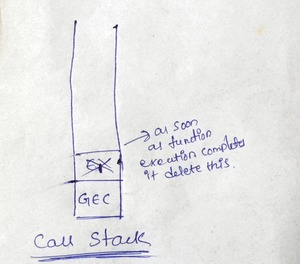

- do u know when u run javascript code alot of things happen behind the scene inside **javascript engine**
- Everything in javascript happens inside an **execution context**
- javascript isn't possible without this beautiful execution context

# what happens when u run Javascript Code?

- when we run javascript program **Global Execution Context** will be created
-         var n =2;
          function square(n) {
            var num = n * n;
            return num;
          }
          square2 = square(n);
          square4 = square(4);

- execution context created in 2 phases

1. **memory creation phase**
2. **code execution phase**

**let us see what happens in first phase which is a memory creation phase ?**

- in first phase javascript **allocate memory to all variables and functions**
- as soon as JS encounter line 1 it will allocate memory to n so it will reserve a memory space for n
- similarly now javascript goes to the line 2 in this it sees that there is a function which is named as **square** now it will allocate some memory for **square function**
- When it allocates memory to n it stores special value which is known as **undefined** and incase of functions it literally **stores the whole code of the function inside this memory space**
- now it will allocate memory to square2 and square4 as well **as there are another variables it will again store undefined for them**

**summary**

- in the first phase javascript skims through the whole program line by line and it allocate memory to all variables and functions
- as soon as it encounter "n" it reserves memory for it and allocate special value **undefined** to it
- **undefined is like placeholder, a special keyword in JS**
- incase of functions this function square this whole function code literally(you can assume it to be) copied over here in the memory space that's how it is
- for the remaining 2 variables again allocates memory and store specical keyword **undefined** to them

**let us now see what happens in second phase which is a code execution phase?**

- second phase is code execution phase
- in this phase this **value 2** over here of n is now being placed actually in this placeholder or the identifier which is n now so **value 2 in the second phase allocated in the place of undefined**
- after finishing **line 1** it goes to **line 2** sees that we nothing to do here **from 2 to 5 line** then it moves to line 6
- here in line no 6 we **invoke the function** here's function invocation
- **when u invoke or execute function brand new execution context is created** and this execution context again has 2 components which is memory component and code component
- here memory creation phase first it will allocate memory to **num and ans** and it will store value as **undefined**
- then in code execution phase **num** will get the value from n
- here **return keyword says now return the control of the program where this function was invoked**
- one more thing that happens when the whole function is executed is that, this whole execution context, for that instance of that function will be deleted
- that means this **whole execution context will now be completely deleted** so now there won't be execution context as soon as we return the value so this whole thing will be deleted
- so in line number 7 again we are invoking a function only diffrence is we are passing value 4 over here as an argument directly that's it
- as soon as this function invokation happens again brand new execution context will be created
- so as soon as Javascript done with all its work now the program is finished so what will happen is the **whole global execution context also deletes**. it goes off

**what do u mean by function invocation?**

- **whenever u see function name with parentheses it means that function is now being executed**

# don't u think that this is all too much to manage for javascript engine?

- suppose there is function invocation inside function you would have created execution context inside an exectuion context and maybe again another invocation it can go to any deep level right?
- function invocation inside again function invocation and all these things so its is very difficult for js engine to manage and it does it very beautifully
- it handles everything to manage this exectuion context creation and deletion and the control it manages the stack it's known as **callstack**
- this is beautiful thing in javascript **it has its own call stack**

**what is a call stack ?**

- **its a stack and everytime in the bottom of the stack we have our global execution context**
- that means whenever any js program is run this call stack is populated with this global execution context
  whole execution context is pushed inside inside this stack
- rememeber whenever function is invoked a new execution context is created so this execution context put inside the call stack so **let me just denote it by E1** which is execution context 1
- once we are done with executing this function we return the **ans** so what happened now this **E1 is popped out of the stack** and control goes back to the global execution context where it left
- so control goes back to the line number 6 okay? got it?
- and then we move on to line number 7 where the new function was invoked and new **execution context** will be created similarly E2 will move up to the stack
- once whole function was executed then E2 will also move out of stack and control goes back to global execution context
- **so this call stack only for managing these execution contexts**
- after whole thing is executed the call stack gets empty the **GES** also gone from this call stack

- **call stack maintains the order of execution of execution contexts**

# Hoisting

-     getName()
      console.log(x);
      var x = 7;
      function getName() {
        console.log("Namasthe Javascript");
      }

      output:
      Namaste Javascript
      undefined

- In JS, before the code is executed, the variables get initialized to undefined.
- Hoisting is a phenomenon in javaScript by which you can access variables and functions even before you have initialized them or you have put some value on them. you can access it without any error.
- Hoisting allows functions to be safely used in code before they are declared
- even before start executing javascript program memory allocated to each and every variables and functions
- even before this code has executed javascript has reserve a memory for x and place a special placeholder undefined to it
- incase of function whole code put in here for getName we can see actually copy of function when u try to debug in browser

**diffrence b/w not defined and undefined**

-     getName()
      console.log(x);

      function getName() {
        console.log("Namasthe Javascript");
      }

- suppose if u have removed the variable initialization x here as soon as it goes to the first line now we haven't reserved memory for x only we reserved memory for getName function
- now if it try to access x here there is no memory allocated for x and here x is not present that means now javascript throw an error like **reference x is not defined** that means nowhere x is initialized in the program but you are trying to access the value of x

-     getName()
      var getName = () => {
        console.log("Namasthe Javascript");
      }
- suppose incase of arrow function it behaves like a variable not like a function so in memory allocation face **it will allocate memory with the placeholder undefined just like x**
-     getName()
      var getName = function () {
        console.log("Namasthe Javascript");
      }
- even in this case also it behave just like variable only
- <a href="/[Title](index.js)">Javascript</a>
